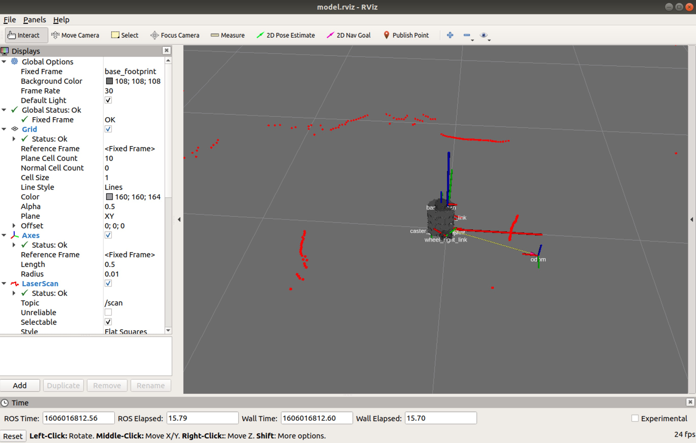

# MOBILE ROBOT Workshop 
# for Highschool student in Robotics and AI Camp KMITL
# https://github.com/syanyong/mobile_robot_raicamp

### Step 1. ON LABTOP
```jsx
roscore
```
### Step 2. ON ROBOT
```jsx
roslaunch turtlebot3_bringup turtlebot3_robot.launch
```
### Step 3. ON LABTOP
```jsx
roslaunch turtlebot3_teleop turtlebot3_teleop_key.launch
```
### Step 4. ON LABTOP
```jsx
roslaunch turtlebot3_bringup turtlebot3_remote.launch
```
### Step 5. ON LABTOP
```jsx
rosrun rviz rviz -d `rospack find turtlebot3_description`/rviz/model.rviz
```


### Step 6. ON LABTOP
> Quit rviz on step 5 before run this step
```jsx
roslaunch turtlebot3_slam turtlebot3_slam.launch slam_methods:=gmapping
```

# GITHUB URL

